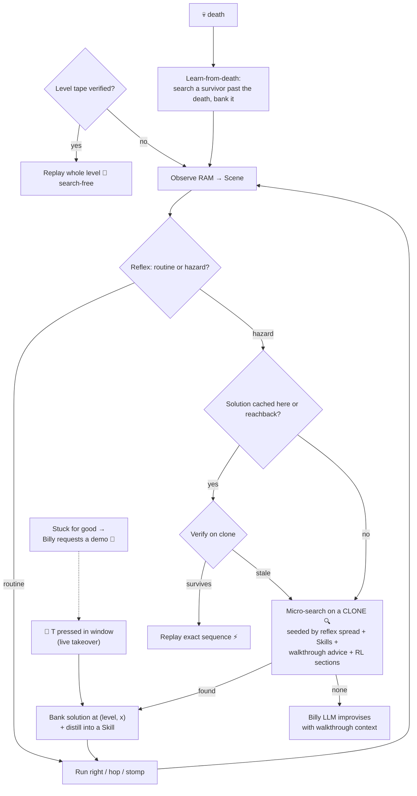

# Billy Mitchell 🕹️

An agentic retro game-player that **learns to beat levels and carries that learning forward to new
games**. Billy perceives the game by reading emulator RAM, plays through a simulated controller,
and **gets faster every attempt** by banking the exact solutions he discovers. He learns from four
sources: **his own play** (search, tapes, learn-from-death), **game walkthroughs** (drop a FAQ text
in `walkthrough/`), **human demos** (teleop, or press **T** mid-run to take the controller), and
**RL sub-policies** at timing hazards. He has the personality of the real Billy Mitchell: cocky,
boastful, never wrong, and quick to blame a "glitchy cartridge" when he dies.

Playing today: **Super Mario Bros**, **SMB2-Japan (Lost Levels)**, **The Legend of Zelda** — and a
**Super Mario World (SNES)** scaffold awaiting a ROM (same engine, second console).

The emulator runs **in-process** via [stable-retro](https://github.com/Farama-Foundation/stable-retro)
— no external process, no file IPC, and **deterministic state cloning** so Billy can plan invisibly.

## The idea: discover once, replay forever

A local LLM is far too slow to react ~60×/sec, so Billy is **not** a frame-by-frame controller.
Instead he learns a **position-keyed policy** the first time he sees each hazard:

1. **Tapes** replay whole level/screen trajectories first: a verified input stream from the level
   entry re-clears the level **search-free in seconds** (the `tape%` column). Tapes extend when
   they run out, chain across screens, and persist partials to the frontier.
2. **Reflex** runs the routine play (run right, hop gaps, stomp enemies) every frame — no LLM.
3. At a hazard, Billy **micro-searches on a cloned copy of the game** (invisible to the live run) for
   a button sequence that *verifiably survives and makes progress*, and **caches it** keyed to where
   it happened — `(level, x)`. Candidates come from the reflex spread, **transferable Skills**
   (including maneuvers auto-distilled from earlier wins), and the **walkthrough's advice** for
   this situation. `BILLY_PARALLEL_SEARCH=N` fans candidates out to N emulator workers.
4. On any later pass he **replays that exact sequence** — no search, no LLM. Each hazard solved once
   is solved forever, so later attempts only search the *new* frontier. High-reach solutions banked
   a few tiles away are picked up too (**reachback**), clone-verified before trust.
5. On a **death**, he searches backward from the last safe spot for a sequence that gets *past* the
   death, and banks it (learn-from-death) — this is what advances the frontier.
6. Because enemies move, a cached plan is **verified on a clone first**; if it's gone stale he
   live-searches with the enemy where it *actually* is now (replay-verify → live-search).
7. When *everything* misses repeatedly, Billy **asks you for a demo** (`data/demo_requests.jsonl`) —
   or you volunteer one live by pressing **T** in the watch window.

The LLM (Billy + Coach) is consulted only for genuinely novel/stuck moments and persona — it is out
of the hot loop. When consulted, it reads the situation-relevant walkthrough lines too.



## The knowledge stack → cross-game transfer

Advice flows down, verified truth flows up — the walkthrough says what to *try*, search proves what
*works*, the cache/tapes remember it *forever*, and your demos fill what nothing else can:

- **Walkthrough guide** (`knowledge/guide.py`) — drop any text FAQ at `walkthrough/<SYSTEM>/<game>`
  and the first run **ingests it once** (local-LLM read merged with a heuristic parse; cached to
  `data/guides/`). Steps are embedded; the ones matching the current situation seed search
  candidates and inform the LLM prompt. Advice only — everything is clone-verified before commit.
- **SolutionCache** (`knowledge/cache.py`) — *exact* solutions, replayed deterministically. Keyed on
  the engine's generic `(level_key, progress)`, so the whole discover-once/replay-forever capability
  is **game-agnostic**.
- **Tapes** (`knowledge/tape.py`) — whole-trajectory input streams per level/screen. A verified tape
  re-clears a level in wall-clock seconds with zero search; tapes self-heal (repeated verify
  failures drop a stale tape so an honest one takes the slot).
- **Skill library** (`knowledge/skills.py` + `knowledge/distill.py`) — *abstract* tactics carried as
  embeddings, **auto-distilled** from every significant banked win and human demo. On a new game the
  cache is empty, but skills retrieved by situation-similarity **seed the search** with
  carried-forward tactics. Skills only widen the search set — they never blind-replay, so transfer
  can't cause a wrong action.
- **Human demos** (`teleop.py`, live **T** takeover) — one playthrough of a wall becomes a cache
  entry + tape segment + distilled skill + BC warm-start for RL training. Pull-based (Billy files
  requests when stuck) and push-based (you grab the controller when you see him struggle).
- **Shared platformer reflex** (`games/common/platformer.py`) — the whole side-scroller policy,
  parameterised by a per-game `PhysicsProfile` and LOGICAL buttons (A=jump, B=run) that each
  console's controller translates physically. **SMB2-Japan** plays with *zero new reflex code*, and
  the same reflex will drive **Super Mario World on SNES** (`systems/snes/` maps logical A→SNES B).

## Setup

```bash
./emulator/setup_retro.sh          # creates .venv, installs deps, imports the ROM
```
You must supply legally-obtained ROMs in `roms/` (gitignored) and re-run
`python -m retro.import roms/` after adding one: `smb.nes`, optionally `smb2j.nes`, `zelda.nes`,
and (pending) an SMW ROM — SNES bring-up checklist in
[billy/games/smw/STATUS.md](billy/games/smw/STATUS.md), starting with `probe_smw_ram.py`.

The LLM tiers are optional — run with `--no-llm` for the pure learning loop. To enable Billy/Coach
and walkthrough LLM-reading, run LM Studio on `localhost:1234` with a chat model + the
`nomic-embed-text` embedder. Billy auto-resolves whatever chat model is actually loaded (the UI
name rarely matches the API id); pin one with `BILLY_CHAT_MODEL`.

## Run

Everything is driven by `run.py`. Always use the project venv (`.venv/bin/python`). The simplest run:

```bash
.venv/bin/python run.py --attempts 20                      # play + learn, watch the window
```

Common recipes:
```bash
# Pure learning loop, watch in a real-time window (no LLM needed):
.venv/bin/python run.py --attempts 6 --no-llm

# Fast headless benchmark (no window, no realtime pacing):
BILLY_HEADLESS=1 .venv/bin/python run.py --attempts 10 --no-llm

# Enable the hazard-scoped RL sub-policies (e.g. Billy crosses 1-3's tree-top section):
.venv/bin/python run.py --attempts 6 --no-llm --rl-sections

# Start clean (wipe everything Billy has learned) and watch from scratch:
.venv/bin/python run.py --attempts 6 --no-llm --rl-sections --fresh

# Second game — SMB2-Japan, seeded with the SMB skills it carries forward:
.venv/bin/python run.py --game smb_lost --seed-skills

# Zelda — first run auto-ingests walkthrough/NES/zelda into route knowledge:
.venv/bin/python run.py --game zelda --attempts 5 --no-llm

# Wide searches across 4 emulator workers:
BILLY_PARALLEL_SEARCH=4 BILLY_HEADLESS=1 .venv/bin/python run.py --attempts 6 --no-llm
```

### Flags (`run.py --help`)
| Flag | Meaning |
| --- | --- |
| `--attempts N` | How many attempts to play (default 10). |
| `--game smb\|smb_lost\|zelda\|smw` | Which title (default `smb`; `smw` needs its ROM — see STATUS.md). |
| `--no-llm` | Pure learning loop (reflex + cache + search), no LLM. Best first smoke test. |
| `--no-guide` | Skip walkthrough ingestion/usage for this run. |
| `--rl-sections` | Enable hazard-scoped RL sub-policies; they seed micro-search with a learned crossing that search verifies and the cache banks. Needs a trained model under `data/rl/` (see below). |
| `--rl MODEL` | Use a whole-level PPO policy (a `.zip` from `train_rl.py`) as the reflex tier; the hand-crafted reflex stays the fallback at hazards. |
| `--seed-skills` | Seed the SkillLibrary with SMB's transferable tactics (cross-game carry-forward). |
| `--fresh` | Wipe learned solutions, skills, and lessons before starting. |

### Environment knobs
| Var | Effect |
| --- | --- |
| `BILLY_HEADLESS=1` | No window — fast. (Default is windowed/watchable.) |
| `BILLY_TURBO=1` | When windowed, drop the 60fps realtime pacing (run as fast as it draws). |
| `BILLY_MAX_FRAMES=N` | Cap an attempt's length (a ~10-game-minute safety cap by default). |
| `BILLY_REPEAT_LEVEL=1` | Eval mode: end each attempt at the first clear so the **same** level repeats and the compounding curve is visible. |
| `BILLY_RETRO_GAME=id` | Override the stable-retro integration id. |
| `BILLY_PARALLEL_SEARCH=N` | N emulator worker subprocesses evaluate search candidates concurrently (default 0 = serial, the regression baseline). |
| `BILLY_DISTILL=0` | Disable skill distillation (banked maneuvers → transferable `sequence` skills). On by default. |
| `BILLY_REACHBACK_MIN_GAIN=N` | Min px gain for reachback (clone-verified pickup of long solutions banked a few tiles behind). Default 200. |
| `BILLY_AUTO_TRAIN=0` | Disable the between-attempt stuck trainer (offline search / quick section training / demo requests). |
| `BILLY_CHAT_MODEL=id` | Pin the LM Studio chat model (default: auto-resolve whatever is loaded). |
| `BILLY_PAD_*` | Per-run gamepad overrides (see `teleop.py calibrate` for the persistent map). |

> **Watching tip:** without `BILLY_HEADLESS=1` a "Billy Mitchell" window opens and plays in real
> time. Micro-search runs on an invisible clone, so on screen you only ever see committed forward
> play — never a rewind. And you can press **T** anytime to take the controller (see
> "Teach Billy" below).

**Prove the learning compounds** (Billy clears 1-1 every attempt; the curve prints
search↓ / replay↑ / **tape%**↑ / time↓ with sparkline trends):
```bash
BILLY_HEADLESS=1 BILLY_REPEAT_LEVEL=1 BILLY_MAX_FRAMES=8000 .venv/bin/python -u run.py --attempts 10 --no-llm
```

## Teach Billy — demos and live takeover

One human playthrough of a wall becomes an exact cache entry + tape segment + distilled skill
(+ a BC warm-start for RL training). Two ways to give one:

**Live takeover (push — the fast way).** Run windowed and watch; when Billy struggles, press
**T** in the game window. He freezes, you get the controller from the exact live state
(calibrated pad or keyboard). **ENTER** hands back — if you advanced and survived, the segment
banks instantly and Billy resumes with it. **ESC** discards and rewinds. Dying banks nothing
(his learn-from-death takes over). Clearing into the next level hands back automatically.

**Teleop from a savestate (pull).** When every autonomous tier misses a hazard repeatedly,
Billy files a request in `data/demo_requests.jsonl` with a ready-to-run command:

```bash
# Capture a start state, then play through the wall:
BILLY_HEADLESS=1 .venv/bin/python teleop.py capture --game smb --until-level 1-2 --out data/states/smb_1_2.state
.venv/bin/python teleop.py play --game smb --from-state data/states/smb_1_2.state --bank
# --tape additionally banks the demo as the level/screen's whole-trajectory tape
# (use when --from-state is a level/screen ENTRY); the .demo.json it saves feeds
# BC warm-start training: train_section.py --demo <x.demo.json> ...
```

> **Demo physics, honestly:** an exact input stream binds to its exact starting state. A demo
> from a mid-level savestate replays only from matching approaches (the clone-verify gate
> decides); demos from **level entries** and **live T-takeovers** replay reliably because Billy
> reproduces those states himself. Prefer T takeover for mid-level walls.

### Gamepad calibration

```bash
.venv/bin/python teleop.py calibrate      # one-time; prompts appear IN the game window
```
Press each button when prompted (A/B/START/SELECT, optional FINISH, +SPIN on SNES), then hold
each d-pad direction — the wizard records whatever your pad actually emits (plain buttons,
exact hat tuples for scrambled/rotated hats, any HID axis), verifies each source releases, and
ends with a **review stage**: try everything against the live decode, then ENTER saves to
`data/pad_map.json` (ESC discards). Bluetooth pads that fell asleep get a wake-up wait.
Keyboard always works too: arrows · Z=A · X=B · Tab=Start · RShift=Select.
Mapping precedence: defaults → `data/pad_map.json` → `BILLY_PAD_*` env vars.
`teleop.py pad-debug` shows raw indices if you prefer manual mapping.

## Walkthrough learning

Drop any text FAQ at `walkthrough/<SYSTEM>/<game>` (e.g. `walkthrough/NES/zelda`) and Billy's
first run **ingests it once**: the local LLM extracts actionable steps (merged with a heuristic
directional parse so route lines never get lost; works fully offline too), each step is
embedded, and the parsed guide is cached at `data/guides/<game>.jsonl`. In play, the steps most
similar to the current situation seed search candidates ("head east" → RIGHT holds, verified on
a clone like everything else) and are quoted into the LLM prompt at walls. Delete the cached
jsonl to re-ingest (e.g. after loading a better model in LM Studio); `--no-guide` disables.

## Optional: learned (RL) reflex tier

A PPO policy can replace the hand-crafted reflex as the fast Tier-1 controller, trained against a
Gymnasium wrapper over the *same* in-process emulator + RAM perception (`billy/rl/`). It's optional
(heavy deps) and **coexists** with everything else: the Director order stays cache → reflex →
micro-search → LLM, so the SolutionCache still owns deterministic hazard replay and the verified
search still handles lethal spots — RL just makes routine movement smarter (and falls back to the
hand-crafted reflex at hazards).

```bash
.venv/bin/pip install -r requirements-rl.txt        # torch + stable-baselines3 (cp314 wheels)
.venv/bin/python train_rl.py --timesteps 200000 --n-envs 4 --imitate 4000   # train (BC warm-start)
.venv/bin/python run.py --rl data/rl/ppo_smb        # play with the learned policy
```

### Hazard-scoped RL sub-policies (the part Billy actually uses)

A whole-level RL policy lost to the hand-crafted reflex, but a **narrow** sub-policy trained to cross
*one* section the geometry reflex can't chain (e.g. 1-3's tree-top platform hops) wins. It's wired so
it can only ever fire at its registered hazard — at that spot the controller rolls the policy out on
an invisible clone, and if it gets through alive the Director commits and **banks** that exact button
sequence, so the crossing compounds like any cached solution (1-1/1-2 are untouched).

```bash
# Train a section sub-policy from a savestate at the hazard entrance (see NEXT_STEPS.md to capture one):
.venv/bin/python train_section.py --timesteps 400000 --n-envs 8 \
    --state data/rl/states/smb_1_3_section.state --goal-x 700 --out data/rl/section_1_3

# Warm-start from a human demo (teleop's .demo.json) — PPO fine-tunes a policy that already
# knows the crossing instead of exploring from scratch (the big sample-efficiency lever):
.venv/bin/python train_section.py --demo data/states/smb_1_3_start.demo.json \
    --state data/rl/states/smb_1_3_section.state --goal-x 950 --out data/rl/section_1_3_lift

# Gate it standalone (cross-rate from the savestate), then play with it enabled:
.venv/bin/python eval_section.py --model data/rl/section_1_3 --episodes 20
.venv/bin/python run.py --attempts 6 --no-llm --rl-sections
```

Models live under `data/rl/` (gitignored) — reproduce them with the train scripts. The roadmap for
adding the next sub-policy (the 1-3 moving-lift gap) is in [NEXT_STEPS.md](NEXT_STEPS.md).

## Games

| Game | `--game` | Status |
|------|----------|--------|
| Super Mario Bros | `smb` | Clears 1-1/1-2; 1-3 crossed via demo + RL section; frontier 1-3/1-4 |
| SMB2-Japan (Lost Levels) | `smb_lost` | Plays with zero new reflex code (the transfer proof) |
| The Legend of Zelda | `zelda` | Sword quest solved; east march compounding (tape%→61); wall: #121 combat → Level 1 |
| Super Mario World (SNES) | `smw` | Scaffold complete, awaiting ROM — [bring-up checklist](billy/games/smw/STATUS.md) |

## Tests

```bash
BILLY_HEADLESS=1 .venv/bin/python -m pytest -q tests/
```

## Layout

Three layers — `Game → System → Controller` — behind abstract contracts, so the engine is reusable
across consoles and titles. New system = a new `systems/<x>/`; new game = a new `games/<y>/`.

| Path | Layer | Role |
|------|-------|------|
| `billy/abstractions.py` | engine | Contracts: `Observation`, `Decision`, `Session`, `System`, `Game`, `ReflexPolicy` |
| `billy/director.py` | engine | Game-agnostic loop: tape → cache-first replay (+reachback) → invisible micro-search → learn-from-death → LLM; live **T** takeover |
| `billy/knowledge/cache.py` | engine | `SolutionCache` — position-keyed exact solutions (the compounding policy) |
| `billy/knowledge/tape.py` | engine | `TapeLibrary` — whole-trajectory level/screen replays (search-free re-clears; self-healing) |
| `billy/knowledge/skills.py` · `distill.py` | engine | `SkillLibrary` + auto-distillation of banked maneuvers into transferable `sequence` skills |
| `billy/knowledge/guide.py` | engine | Walkthrough ingestion (LLM + heuristic merge) → search bias + LLM context |
| `billy/knowledge/store.py` | engine | Prose-lesson KB + embedding helpers (LLM strategy/narration) |
| `billy/search_pool.py` | engine | Parallel micro-search worker pool (`BILLY_PARALLEL_SEARCH=N`) |
| `billy/stuck_trainer.py` | engine | Auto-stuck trainer: offline search → quick section train → **demo request** |
| `billy/teleop.py` + `teleop.py` (CLI) | engine | Demo capture/verify/bank; gamepad calibration wizard |
| `billy/rl/` (`section_env`, `section_policy`, `bc.py`) | engine | Hazard-scoped RL sub-policies + behavior-cloning warm-start from demos |
| `billy/agents/billy.py` · `coach.py` | engine | LLM strategist + analyst (off the hot loop) |
| `billy/metrics.py` · `commentary.py` · `persona.py` · `llm.py` | engine | Compounding dashboard (tape%/sparklines), Billy's voice, LLM client (model auto-resolution) |
| `billy/systems/nes/retro_session.py` | system | Console-parameterized in-process retro transport: step, RAM, **state cloning**, invisible search, viewer/teleop |
| `billy/systems/nes/{controller,pad_map}.py` · `system.py` | system | NES pad (logical button bits) + persistent gamepad mapping + system wiring |
| `billy/systems/snes/` | system | SNES: 12-button logical controller (A=jump→SNES B) riding the same transport |
| `billy/games/common/platformer.py` | game | Shared platformer reflex + `PhysicsProfile` + candidate builders |
| `billy/games/smb/{perception,reflexes,tuning,game}.py` | game | SMB: RAM→`Scene`, SMB profile, `SmbGame` |
| `billy/games/smb_lost/game.py` | game | SMB2-Japan — same engine, reuses SMB perception + the shared reflex |
| `billy/games/zelda/` | game | Zelda: perception, top-down reflex, FAQ routing, dungeon scaffold ([STATUS](billy/games/zelda/STATUS.md)) |
| `billy/games/smw/` | game | Super Mario World scaffold — WRAM map, perception, non-linear level identity ([STATUS](billy/games/smw/STATUS.md)) |
| `walkthrough/<SYSTEM>/<game>` | data | Drop text FAQs here — auto-ingested on first run |
| `run.py` | — | Entry point (picks the game, loads guide/skills/sections, runs the engine) |
