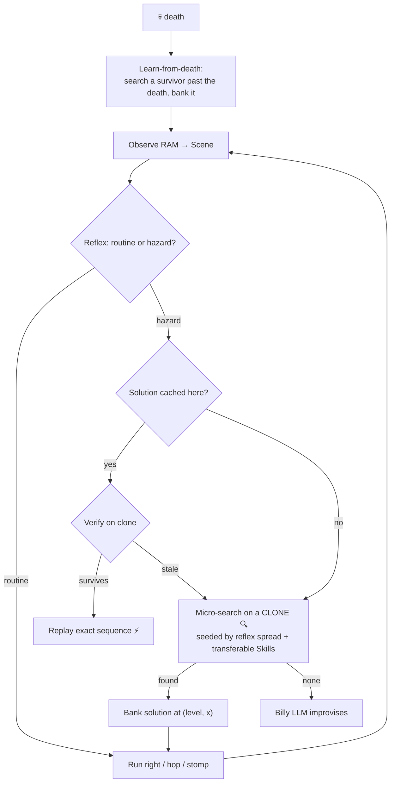

# Billy Mitchell 🕹️

An agentic NES game-player that **learns to beat levels and carries that learning forward to new
games**. Billy perceives the game by reading emulator RAM, plays through a simulated NES controller,
and **gets faster every attempt** by banking the exact solutions he discovers. He has the
personality of the real Billy Mitchell: cocky, boastful, never wrong, and quick to blame a "glitchy
cartridge" when he dies.

The emulator runs **in-process** via [stable-retro](https://github.com/Farama-Foundation/stable-retro)
— no external process, no file IPC, and **deterministic state cloning** so Billy can plan invisibly.

## The idea: discover once, replay forever

A local LLM is far too slow to react ~60×/sec, so Billy is **not** a frame-by-frame controller.
Instead he learns a **position-keyed policy** the first time he sees each hazard:

1. **Reflex** runs the routine play (run right, hop gaps, stomp enemies) every frame — no LLM.
2. At a hazard, Billy **micro-searches on a cloned copy of the game** (invisible to the live run) for
   a button sequence that *verifiably survives and makes progress*, and **caches it** keyed to where
   it happened — `(level, x)`.
3. On any later pass he **replays that exact sequence** — no search, no LLM. Each hazard solved once
   is solved forever, so later attempts only search the *new* frontier.
4. On a **death**, he searches backward from the last safe spot for a sequence that gets *past* the
   death, and banks it (learn-from-death) — this is what advances the frontier.
5. Because enemies move, a cached plan is **verified on a clone first**; if it's gone stale he
   live-searches with the enemy where it *actually* is now (replay-verify → live-search).

The LLM (Billy + Coach) is consulted only for genuinely novel/stuck moments and persona — it is out
of the hot loop.



## Two kinds of learning → cross-game transfer

- **SolutionCache** (`knowledge/cache.py`) — *exact* solutions, replayed deterministically. Keyed on
  the engine's generic `(level_key, progress)`, so the whole discover-once/replay-forever capability
  is **game-agnostic**.
- **Skill library** (`knowledge/skills.py`) — *abstract* tactics ("precise gap jump", "stomp from
  approach", "run-jump a tall obstacle") carried as embeddings. On a new game the cache is empty, but
  skills retrieved by situation-similarity **seed the search** with carried-forward tactics. Skills
  only widen the search set — they never blind-replay, so transfer can't cause a wrong action.
- **Shared platformer reflex** (`games/common/platformer.py`) — the whole side-scroller policy,
  parameterised by a per-game `PhysicsProfile`. A new NES platformer reuses it wholesale; e.g.
  **SMB2-Japan / Lost Levels** (`games/smb_lost/`) plays with *zero new reflex code*.

## Setup

```bash
./emulator/setup_retro.sh          # creates .venv, installs deps, imports the ROM
```
You must supply a legally-obtained `Super Mario Bros (USA).nes` at `roms/smb.nes` (gitignored). For
the second game, drop the SMB2-Japan ROM in `roms/` and re-run `python -m retro.import roms/`.
The LLM tiers are optional — run with `--no-llm` for the pure learning loop. To enable Billy/Coach,
run LM Studio on `localhost:1234` with a chat model + the `nomic-embed-text` embedder.

## Run

Everything is driven by `run.py`. Always use the project venv (`.venv/bin/python`). The simplest run:

```bash
.venv/bin/python run.py --attempts 20                      # play + learn, watch the window
```

Common recipes:
```bash
# Pure learning loop, watch in a real-time window (no LLM needed):
.venv/bin/python run.py --attempts 6 --no-llm

# Fast headless benchmark (no window, no realtime pacing):
BILLY_HEADLESS=1 .venv/bin/python run.py --attempts 10 --no-llm

# Enable the hazard-scoped RL sub-policies (e.g. Billy crosses 1-3's tree-top section):
.venv/bin/python run.py --attempts 6 --no-llm --rl-sections

# Start clean (wipe everything Billy has learned) and watch from scratch:
.venv/bin/python run.py --attempts 6 --no-llm --rl-sections --fresh

# Second game — SMB2-Japan, seeded with the SMB skills it carries forward:
.venv/bin/python run.py --game smb_lost --seed-skills
```

### Flags (`run.py --help`)
| Flag | Meaning |
| --- | --- |
| `--attempts N` | How many attempts to play (default 10). |
| `--game smb\|smb_lost` | Which title (default `smb`). |
| `--no-llm` | Pure learning loop (reflex + cache + search), no LLM. Best first smoke test. |
| `--rl-sections` | Enable hazard-scoped RL sub-policies; they seed micro-search with a learned crossing that search verifies and the cache banks. Needs a trained model under `data/rl/` (see below). |
| `--rl MODEL` | Use a whole-level PPO policy (a `.zip` from `train_rl.py`) as the reflex tier; the hand-crafted reflex stays the fallback at hazards. |
| `--seed-skills` | Seed the SkillLibrary with SMB's transferable tactics (cross-game carry-forward). |
| `--fresh` | Wipe learned solutions, skills, and lessons before starting. |

### Environment knobs
| Var | Effect |
| --- | --- |
| `BILLY_HEADLESS=1` | No window — fast. (Default is windowed/watchable.) |
| `BILLY_TURBO=1` | When windowed, drop the 60fps realtime pacing (run as fast as it draws). |
| `BILLY_MAX_FRAMES=N` | Cap an attempt's length (a ~10-game-minute safety cap by default). |
| `BILLY_REPEAT_LEVEL=1` | Eval mode: end each attempt at the first clear so the **same** level repeats and the compounding curve is visible. |
| `BILLY_RETRO_GAME=id` | Override the stable-retro integration id. |
| `BILLY_PARALLEL_SEARCH=N` | N emulator worker subprocesses evaluate search candidates concurrently (default 0 = serial, the regression baseline). |
| `BILLY_DISTILL=0` | Disable skill distillation (banked maneuvers → transferable `sequence` skills). On by default. |

> **Watching tip:** without `BILLY_HEADLESS=1` a "Billy Mitchell" window opens and plays in real
> time. Micro-search runs on an invisible clone, so on screen you only ever see committed forward
> play — never a rewind.

**Prove the learning compounds** (Billy clears 1-1 every attempt; the curve prints search↓/replay↑):
```bash
BILLY_HEADLESS=1 BILLY_REPEAT_LEVEL=1 BILLY_MAX_FRAMES=8000 .venv/bin/python -u run.py --attempts 10 --no-llm
```

## Optional: learned (RL) reflex tier

A PPO policy can replace the hand-crafted reflex as the fast Tier-1 controller, trained against a
Gymnasium wrapper over the *same* in-process emulator + RAM perception (`billy/rl/`). It's optional
(heavy deps) and **coexists** with everything else: the Director order stays cache → reflex →
micro-search → LLM, so the SolutionCache still owns deterministic hazard replay and the verified
search still handles lethal spots — RL just makes routine movement smarter (and falls back to the
hand-crafted reflex at hazards).

```bash
.venv/bin/pip install -r requirements-rl.txt        # torch + stable-baselines3 (cp314 wheels)
.venv/bin/python train_rl.py --timesteps 200000 --n-envs 4 --imitate 4000   # train (BC warm-start)
.venv/bin/python run.py --rl data/rl/ppo_smb        # play with the learned policy
```

### Hazard-scoped RL sub-policies (the part Billy actually uses)

A whole-level RL policy lost to the hand-crafted reflex, but a **narrow** sub-policy trained to cross
*one* section the geometry reflex can't chain (e.g. 1-3's tree-top platform hops) wins. It's wired so
it can only ever fire at its registered hazard — at that spot the controller rolls the policy out on
an invisible clone, and if it gets through alive the Director commits and **banks** that exact button
sequence, so the crossing compounds like any cached solution (1-1/1-2 are untouched).

```bash
# Train a section sub-policy from a savestate at the hazard entrance (see NEXT_STEPS.md to capture one):
.venv/bin/python train_section.py --timesteps 400000 --n-envs 8 \
    --state data/rl/states/smb_1_3_section.state --goal-x 700 --out data/rl/section_1_3

# Gate it standalone (cross-rate from the savestate), then play with it enabled:
.venv/bin/python eval_section.py --model data/rl/section_1_3 --episodes 20
.venv/bin/python run.py --attempts 6 --no-llm --rl-sections
```

Models live under `data/rl/` (gitignored) — reproduce them with the train scripts. The roadmap for
adding the next sub-policy (the 1-3 moving-lift gap) is in [NEXT_STEPS.md](NEXT_STEPS.md).

## Tests

```bash
BILLY_HEADLESS=1 .venv/bin/python -m pytest -q tests/
```

## Layout

Three layers — `Game → System → Controller` — behind abstract contracts, so the engine is reusable
across consoles and titles. New system = a new `systems/<x>/`; new game = a new `games/<y>/`.

| Path | Layer | Role |
|------|-------|------|
| `billy/abstractions.py` | engine | Contracts: `Observation`, `Decision`, `Session`, `System`, `Game`, `ReflexPolicy` |
| `billy/director.py` | engine | Game-agnostic loop: cache-first replay → invisible micro-search → learn-from-death → LLM |
| `billy/knowledge/cache.py` | engine | `SolutionCache` — position-keyed exact solutions (the compounding policy) |
| `billy/knowledge/skills.py` | engine | `SkillLibrary` — embedding-retrieved transferable tactics (cross-game) |
| `billy/knowledge/store.py` | engine | Prose-lesson KB + embedding helpers (LLM strategy/narration) |
| `billy/agents/billy.py` · `coach.py` | engine | LLM strategist + analyst (off the hot loop) |
| `billy/metrics.py` · `commentary.py` · `persona.py` · `llm.py` | engine | Compounding metrics, Billy's voice, LLM client |
| `billy/systems/nes/retro_session.py` | system | In-process stable-retro transport: step, RAM, **state cloning**, invisible search |
| `billy/systems/nes/controller.py` · `system.py` | system | NES pad (button bits) + system wiring |
| `billy/games/common/platformer.py` | game | Shared NES-platformer reflex + `PhysicsProfile` + candidate builders |
| `billy/games/smb/{perception,reflexes,tuning,game}.py` | game | SMB: RAM→`Scene`, SMB profile, `SmbGame` |
| `billy/games/smb_lost/game.py` | game | SMB2-Japan — same engine, reuses SMB perception + the shared reflex |
| `run.py` | — | Entry point (picks the game, seeds skills, runs the engine) |
